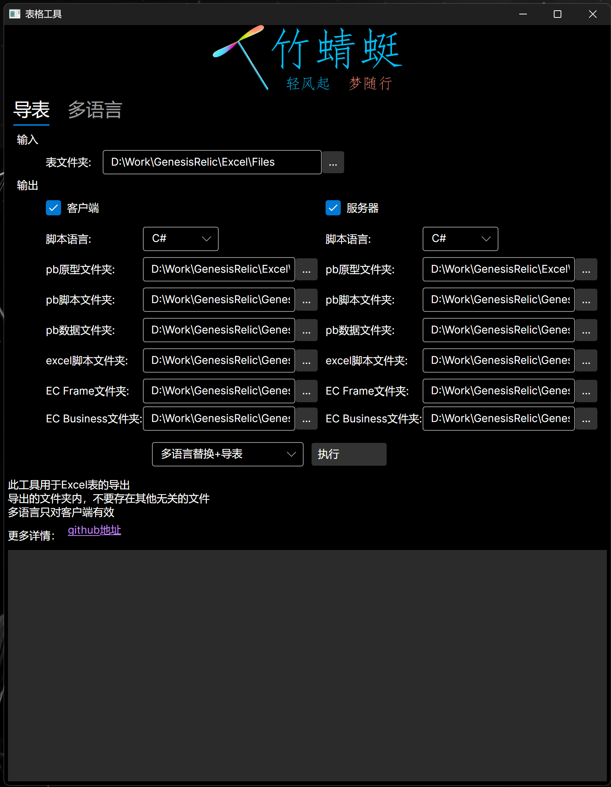
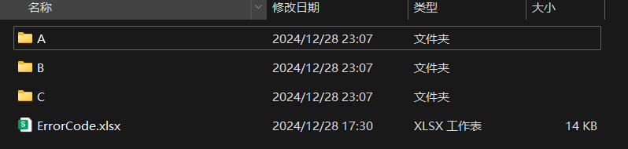
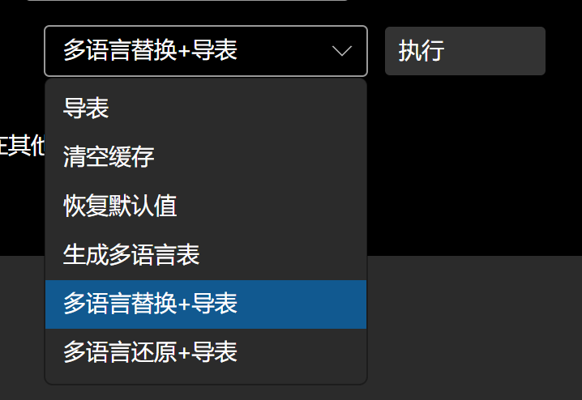
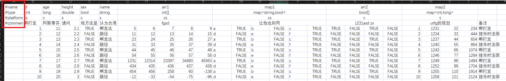
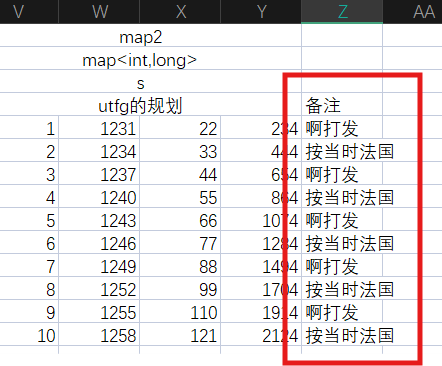
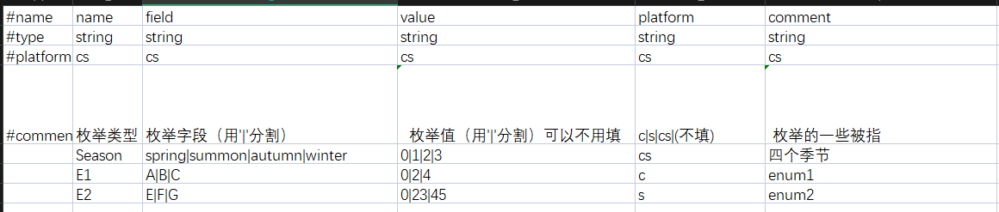
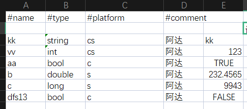
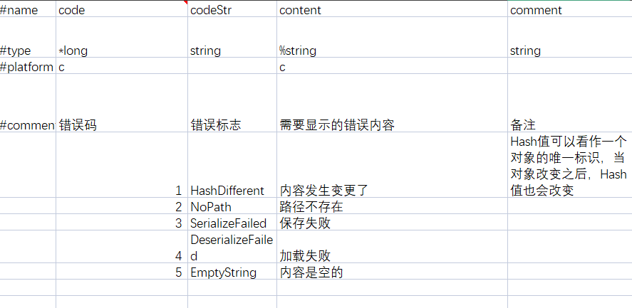
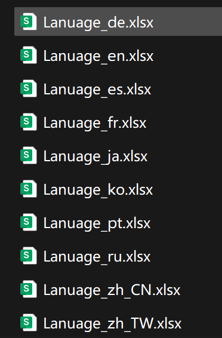
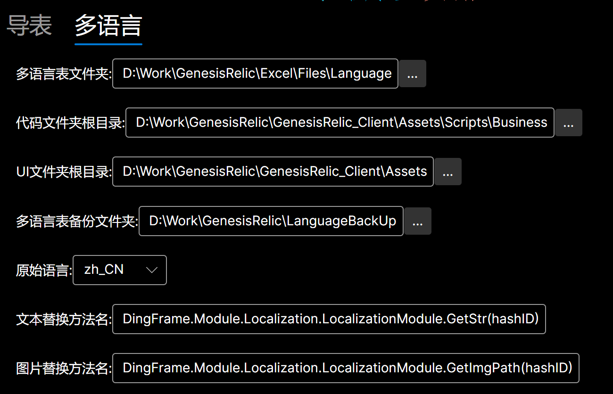

# 功能
	1. 支持双端同时导表（只能是.xlsx, 目前放弃了旧版的.xls）
	2. 多线程导表
	3. 可以扩展导出多种脚本语言
	4. 可生成多语言表，并进行多语言替换

# 解析流程
	普通表流程： 解析表头信息 -> 生成 proto meta 文件 -> 生成 proto Script 文件 -> 解析表数据内容 -> 生成 proto data 文件 -> 生成 excel Script 文件
	特殊表流程：
		Enum：解析表头信息 -> 生成 proto meta 文件 -> 生成 proto Script 文件
		ErrorCode: 解析表头信息和内容 -> 生成 ErrorCode Script 文件(静态，全局，键值对) 
		SingleExcel: 纵向解析表头信息 -> 生成 SingleExcel Script 文件(静态，业务全局，键值对)

# 图形界面说明

	
	对于非技术人员而言，只需要关注：1. 输入的表格文件夹；2. 执行按钮以及旁边的操作项；3. 最下面的Log信息栏；
	至于导出目录，一般用默认值就可以，至于这个默认值，让技术人员一开始设置好就可以了；当然要是你足够自信，也可以自行设置导出目录
	
## 1.导出目录
	因为导表的核心用了 protobuf; 所以 有 proto原型， 原型生成的脚本，以及proto数据 的目录
	至于 EC Frame 和 EC Business; 则是针对 ErrorCode这张特殊表的，具体请看下面的表格规则说明

## 2.表格文件夹
	这里输入得是表格文件夹的根目录；在其目录下面，还可以嵌套多个子目录:

	拥有多级目录，可以方便程序模块化的加载和释放表格资源

## 3.功能操作项

	

# 表格规则说明
示例:

	标红的地方就是表头的类型
	目前支持的表头类型有：#name，#type，#platform，#comment
	如果没有#的行，表示内容行；如果#后面是其他内容，会报错
	一个表，可以多个 sheet; 都是会被导出的：最后导出的名字类似：表格名字_sheet名字

## 1. 表头类型说明
### a.#name
	1. 表示字段的名字，如果是空，那么这个字段将不会导出
	2. 名字不能重复，否则报错

### b.#tpye
	1. 基础类型：int， long, double, bool, string
	2. 容器：T[], map<k, v>: T, k, v只能是基础类型或者枚举类型，否则报错。因为proto的限制，map<k,v> 指定的类型不能是 double类型
	3. 枚举类型，枚举需要在Enum表中事先定义
	4. 本地化类型：%string: 需要多语言处理的文本；%%string: 需要多语言处理的图片路径
	5. 索引Id:  *"typeName": 独立key; **"typeName": 联合key

	注意：
		1. 类型名字可以空，但是改字段将不会导出；
		2. 如果是其他的类型字段，会报错
		3. 如果是索引id, 那么就不能重复

### c.#platform
	c: 客户端
	s: 服务器
	cs: 服务器端和服务器都会导出
	空：都不导出

### d.#comment
	对字段的说明。它不会作为数据导出，只是用于说明
	如果你不单单是要对某个字段说明。也想对具体某一行的数据内容做说明怎么办呢？
		因为 name, type, platform 字段空，就不会导出，自然可以利用这点写一些自定义的注释。比如：
		

## 2.特殊表

### a.枚举表
	表格名字是固定的： Enum.xlsx; 并且只能有一个
示例:

	这些表头字段的名字（name, field, value, platform, comment）和类型是固定的，缺少或者不匹配会报错
	field 和 value 字段是对应的
	因为proto的原因，value第一个值只能0
	
### b.单例表
	一般的表都是有多行数据内容的，但是存在一张表，它只有一行数据内容，比如定义全局变量的表，只需要一行数据就可以了。这样的表就是所谓的单例表
	因为只有一行的数据内容，如果把表纵向排列，更加方便些

示例:

	（注意看，这个表的排版是纵向的）
	单例表是通过名字前缀确定的，只要前缀是"[Single]"就被定义为单例表，按照单例表规则解析。单例表可以有多个。

### c.ErrorCode表
	客户端和服务器为了统一错误（也可以是其他的）信息，需要这样表中定义的字段来沟通。一般有程序维护，策划只需要填写显示的错误信息内容就可以了
	
示例:

	ErrorCode表是按照名字确定的, 只能有一个

# 多语言
## 支持的语言
类型					|枚举|简写				
------------------------|----------------------|---
简体中文				|zh_CN					|简体中文
繁体中文|zh_TW|繁體中文
日语					|ja						|日本語
韩语					|ko						|한국어
英语					|en						|English
法语					|fr						|français
德语					|de						|Deutsch
俄语					|ru						|русский
西班牙语				|es						|Español
葡萄牙语				|pt						|Português

## 多语言操作的范围
	1. 表格中设置了 %string, %%string 的字段，都可以导入到新的多语言表格中
	2. 代码文件，某些标志性的字符串，也可以导入到多语言表格中
	3. UI文件中，某些标志性的字符串，也可以导入到多语言表格中

## 核心逻辑
### 生成多语言表
	将表格，代码，UI中的被标明为多语言的字段，收集起来，写入到语言表格中（根据语言类型，会有不同的语言表）

### 替换多语言
	因为导表的核心是protobuf, 所以，只需要替换 proto 生成的脚本文件的属性字段为 多语言解析方法就可以了
	至于 代码和UI的替换逻辑，其实可以自定义：只需要修改 Data/Language/CodeLanguageHandler.cs 和 OuterLanguageHandler.cs 这两个文件就可以了。这两个文件，在运行的时候会被动态编译，然后利用反射去调用其中的方法，从而进行相关的多语言操作
	目前我的项目中的逻辑是：
		代码里面 LocalizationModule.GetStr("一段字符串") 和 LocalizationModule.GetImgPath("一段图片吧路径") 就会被替换
		UI的话，因为使用了UIToolKit, 所以自定义了 DLabel, DButton, DTextField, 并且里面有bool属性(Localization) 标明是否要进行多语言替换
	
### 还原多语言
	表格的话，正常导表，就不会有多语言替换
	代码和UI, 其实就是逆过程，可以参考 CodeLanguageHandler.cs 和 OuterLanguageHandler.cs 这两个文件

## 界面

	这一块最好由技术人员设置。
	多语言表文件夹：生成的多语言表放置的目录位置
	代码文件夹根目录：需要被替换多语言的代码文件的根目录，这里面的所有相关文件都会被替换多语言
	UI文件夹根目录：同理
	多语言备份文件夹：因为生成多语言表的时候，会覆盖上一次表格，为了再次翻译方便，会把之前的表格备份起来
	原始语言：执行当前的表格里需要被翻译的内容是什么语言
	文本替换方法名：解析多语言的方法，替换的时候，它会替换原先的文本，而那个hashID是根据文本计算出来的，它的名字不能变

# Q&A
	1. 这个工具为什么打不开呀？
	可能是环境不对，这个工具目前只能运行在Windows上，并且需要有.net环境，下载一个.net9 sdk:

[.net9 sdk page](https://dotnet.microsoft.com/en-us/download/dotnet/9.0).